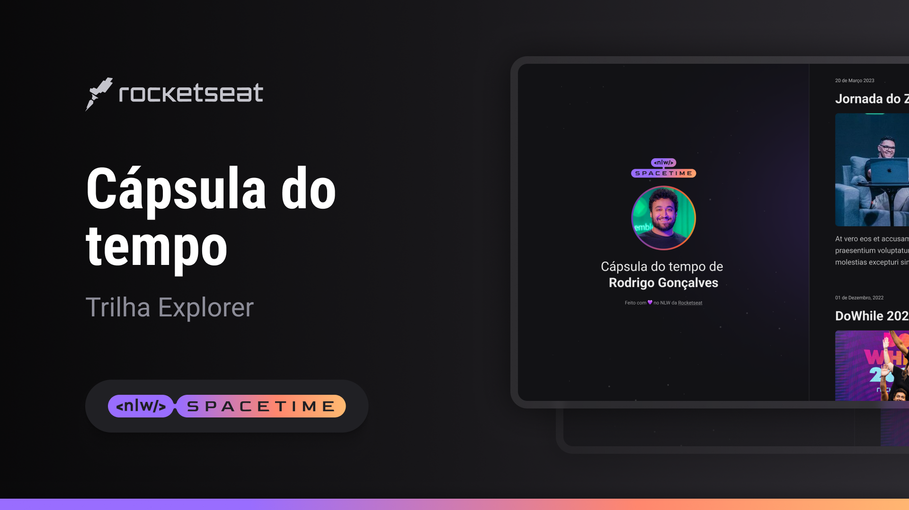

## Projeto 
Esse é um Projeto Web responsivo de criação de um capsula do tempo em uma timeline

## Tecnologia 
Esse projeto foi desenvolvido durante o NLW da Rocjetseat com as seguintes tenologias :

- HTML
- CSS
- Git e Github

## Layout

ocê pode visualizar o layout do projeto através
[Desse link](https://www.figma.com/file/5VEJonw0wGX8YJKlOvIFTZ/C%C3%A1psula-do-tempo-%E2%80%A2-Trilha-Explorer-(Community)-(Copy)?type=design&node-id=306%3A84&t=Opo8Napd9CBeNceo-1)

